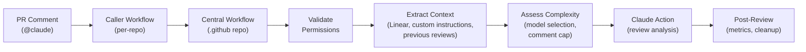

# Deploying Claude PR Review to Organization Repositories

This guide explains how to enable Claude-powered PR reviews in Quantivly repositories using the centralized reusable workflow powered by the official [`anthropics/claude-code-action`](https://github.com/anthropics/claude-code-action).

## Overview

The Claude PR review system uses a **reusable workflow** pattern:

- **Central workflow**: Lives in `quantivly/.github/.github/workflows/claude-review.yml`
- **Caller workflows**: Minimal files in each repository's `.github/workflows/` directory
- **Secrets**: Automatically inherited from organization secrets
This maintains a single source of truth while allowing easy deployment to any repository.

### Architecture



**Flow**: A `@claude` comment on a PR triggers the repo's caller workflow, which delegates to the central reusable workflow in the `.github` repository. The central workflow validates permissions, gathers context (Linear issue, previous reviews, custom instructions), assesses PR complexity to select the appropriate model tier, runs the Claude review action, and handles post-review tasks (metrics injection, progress comment cleanup, error reporting).

## What Changed (v2.0 Migration)

The review system was migrated from a custom Python script to the official `anthropics/claude-code-action@v1`:

| Feature | v1.0 (Custom Python) | v2.0 (Official Action) |
|---------|---------------------|------------------------|
| Review Engine | Custom `claude-review.py` | `anthropics/claude-code-action@v1` |
| Inline Comments | Manual position mapping | Batched via GitHub Reviews API `comments` array |
| Progress Tracking | None | Built-in with milestones |
| Retry Logic | Custom retry wrapper | Built-in |
| Maintenance | Manual updates | Anthropic-maintained |

**Breaking Changes**: None - the caller workflow interface remains unchanged.

## Prerequisites

1. **Organization secrets configured** (already done):
   - `ANTHROPIC_API_KEY` - Claude API access (required)
   - `LINEAR_API_KEY` - Linear issue context (optional, for requirement validation)
   - `CLAUDE_APP_PRIVATE_KEY` - GitHub App private key for Claude[bot] identity (optional)
   - `GITHUB_TOKEN` - Automatically provided by GitHub Actions

2. **Organization variables configured** (already done):
   - `CLAUDE_APP_ID` - GitHub App ID for Claude[bot] identity

3. **GitHub App "Claude" installed** (already done):
   - App provides custom identity so reviews appear as "Claude[bot]" instead of "github-actions[bot]"
   - App needs permissions: Contents (Read), Issues (Write), Pull requests (Write)
   - App must be installed to the organization with access to all repositories

4. **Repository permissions**:
   - Caller must be org member or repo collaborator with write access
   - Workflow must have permissions: `contents: read`, `issues: write`, `pull-requests: write`

5. **`.github` repository access enabled** (needs verification):
   - Navigate to Settings → Actions → General in the `.github` repository
   - Under "Access", ensure "Accessible from repositories in the 'quantivly' organization" is selected

## Deployment Steps

### Step 1: Copy Caller Workflow

Copy the caller workflow template to the target repository:

```bash
# Navigate to target repository
cd ~/quantivly/<repo-name>

# Create workflows directory if it doesn't exist
mkdir -p .github/workflows

# Copy the caller workflow template
cp ~/quantivly/.github/workflow-templates/claude-review-caller.yml \
   .github/workflows/claude-review.yml
```

### Step 2: Commit and Push

```bash
git add .github/workflows/claude-review.yml
git commit -m "enh: Add Claude-powered PR review workflow"
git push origin master
```

### Step 3: Verify Deployment

1. **Create a test PR** in the repository
2. **Comment** `@claude` on the PR
3. **Check Actions tab**: Navigate to `https://github.com/quantivly/<repo>/actions`
4. **Verify workflow runs**: Should see "Claude PR Review" workflow triggered
5. **Confirm review posted**: Check PR for Claude's review comment with inline annotations

## Features

### Adaptive Model Selection

The workflow automatically selects the Claude model based on PR complexity:

| PR Type | Model | Approximate Cost |
|---------|-------|-----------------|
| Docs/config only (`.md`, `.yml`, `.json`, etc.) | Haiku 4.5 | ~$0.10-0.15 |
| Standard code changes (<500 lines) | Sonnet 4.5 | ~$0.60-0.90 |
| Large diffs (>500 lines) or security-sensitive paths | Opus 4.6 | ~$2.00-3.00 |

Security-sensitive paths are detected by filename patterns: `auth`, `security`, `login`, `password`, `token`, `session`, `permission`, `access`, `crypto`, `encrypt`, `hipaa`, `phi`.

### Concurrency

The caller workflow uses `cancel-in-progress: true`. If a developer comments `@claude` twice on the same PR, the second trigger cancels the first review, saving cost and ensuring only the latest review completes.

### Adaptive Comment Caps

The maximum number of inline comments scales with PR size: `min(12, ceil(diff_lines / 50))`, with a minimum of 3. Small PRs get fewer comments (avoiding nitpicking), large PRs get more (ensuring thoroughness).

### Tool Capabilities

The workflow uses built-in MCP servers and CLI tools:

**Batched Review API** (via `gh api`):
- Submits review event with all inline comments in a single API call
- Comments attached directly to specific diff lines
- Uses GitHub Reviews API `POST /repos/.../pulls/.../reviews` with `comments` array

**Linear MCP** (via `.mcp.json`):
- Fetches issue description and acceptance criteria
- Validates PR alignment with requirements

**gh CLI**:
- Submits formal review events (APPROVE/REQUEST_CHANGES/COMMENT)
- Reads PR metadata and cross-repo files
- Updates progress comments

### Progress Tracking

Reviews now include a progress tracking comment showing:
- ✅ Completed steps
- ⏳ In-progress steps
- Checklist of analysis phases

### Inline Comments

Claude posts inline comments directly on specific lines in the diff:
- Security vulnerabilities marked with 🚨
- Bug risks marked with ⚠️
- Suggestions marked with 💡
- "Fix this" links for actionable issues

### Linear Integration

When PR title includes Linear issue ID (format: `AAA-####`):
- Fetches issue description and acceptance criteria
- Validates PR alignment with requirements
- References specific requirements in feedback

### Custom Reviewer Instructions

Add instructions after `@claude` in your comment:

```
@claude focus on security and HIPAA compliance
@claude please pay attention to the error handling in the retry logic
@claude this is a performance-critical path, check for N+1 queries
```

## Troubleshooting

### Workflow Not Triggering

**Symptom**: No workflow runs appear after commenting `@claude`

**Potential causes**:
1. Caller workflow not merged to default branch
2. Syntax error in workflow file
3. Repository doesn't have Actions enabled

**Solution**:
```bash
# Check if workflow exists on default branch
git checkout master
git pull origin master
cat .github/workflows/claude-review.yml

# Check for YAML syntax errors
yamllint .github/workflows/claude-review.yml

# Enable Actions if disabled
# Navigate to: Settings → Actions → General → Enable Actions
```

### Permission Denied

**Symptom**: Workflow runs but Claude responds with permission denied message

**Potential causes**:
1. Commenter is not org member or collaborator
2. Commenter has read-only access

**Solution**:
- Verify commenter has write/maintain/admin access to repository
- Add collaborator via Settings → Collaborators

### Reusable Workflow Not Found

**Symptom**: Error: `Workflow file not found: quantivly/.github/.github/workflows/claude-review.yml@master`

**Potential causes**:
1. `.github` repository access not enabled for organization
2. Incorrect path or branch reference
3. Workflow file doesn't exist

**Solution**:
```bash
# Verify workflow exists in .github repo
cd ~/quantivly/.github
ls -la .github/workflows/claude-review.yml

# Enable access in .github repository:
# Settings → Actions → General → Access
# Select "Accessible from repositories in the 'quantivly' organization"
```

### Secrets Not Available

**Symptom**: Workflow fails with API authentication errors

**Potential causes**:
1. Organization secrets not configured
2. `secrets: inherit` not working
3. Secrets have wrong names

**Solution**:
```bash
# Verify organization secrets exist:
# Navigate to: https://github.com/organizations/quantivly/settings/secrets/actions
# Confirm: ANTHROPIC_API_KEY exists (required)
# Optional: LINEAR_API_KEY, CLAUDE_APP_PRIVATE_KEY

# Alternative: Explicitly pass secrets (not recommended)
# Edit caller workflow to replace "secrets: inherit" with:
secrets:
  ANTHROPIC_API_KEY: ${{ secrets.ANTHROPIC_API_KEY }}
  LINEAR_API_KEY: ${{ secrets.LINEAR_API_KEY }}
```

### Linear MCP Not Connecting

**Symptom**: Review completes but doesn't include Linear context

**Potential causes**:
1. `LINEAR_API_KEY` not set
2. MCP server connection timeout
3. Invalid Linear API key

**Solution**:
- Verify `LINEAR_API_KEY` is set in organization secrets
- Check workflow logs for MCP connection errors
- Regenerate Linear API key if expired

### Cross-Repository Context Not Working

**Symptom**: Review doesn't fetch code from related repositories

**Potential causes**:
1. `GITHUB_TOKEN` doesn't have permissions to access other repositories
2. GitHub API rate limits
3. Repository is private and token lacks access

**Solution**:
- Cross-repository access uses `gh api` commands with the workflow's `GITHUB_TOKEN`
- For private repositories, ensure the GitHub App or token has access
- Check workflow logs for API errors

### Review Fails or Times Out

**Symptom**: Workflow runs but fails with API error

**Potential causes**:
1. Anthropic API rate limits
2. Large PR causing timeout (now 15 minutes)
3. Plugin installation failure

**Solution**:
- Wait 5-10 minutes and retry with `@claude`
- Check [workflow logs](https://github.com/quantivly/<repo>/actions) for specific error
- For very large PRs, consider breaking into smaller PRs

## Rollout Status

| Repository | Status | Notes |
|------------|--------|-------|
| `.github` | ✅ Central workflow | Reusable workflow deployed |
| `sre-core` | ✅ Deployed | First production repository |
| `hub` | ⏳ Phase 2 | Ready for deployment |
| `sre-ui` | ⏳ Phase 2 | Ready for deployment |
| `quantivly-dockers` | ⏳ Phase 3 | Awaiting Phase 2 completion |

## Maintenance

### Updating the Review Logic

When making changes to the review workflow:

1. **Edit central workflow** in `quantivly/.github/.github/workflows/claude-review.yml`
2. **Test in `.github` repo** (create PR, comment `@claude`)
3. **Commit and push** changes
4. **Changes propagate automatically** to all repositories using the caller workflow

No changes needed in individual repositories unless:
- Changing trigger conditions
- Modifying concurrency settings
- Adjusting permissions

### Tool Updates

Built-in MCP servers update automatically with the `claude-code-action` version. No manual intervention needed.

The central workflow pins `anthropics/claude-code-action` to a specific commit SHA for supply chain security. To update the action version, look up the latest commit SHA for the desired tag and update the `uses` line:

```yaml
uses: anthropics/claude-code-action@<commit-sha>  # v1
```

### Removing Claude Review

To disable Claude review in a repository:

```bash
cd ~/quantivly/<repo-name>
git rm .github/workflows/claude-review.yml
git commit -m "ref: Remove Claude PR review workflow"
git push origin master
```

## Cost Monitoring

Review costs vary by PR complexity due to adaptive model selection:
- **Docs/config PRs**: ~$0.10-$0.15 (Haiku 4.5)
- **Standard code PRs**: ~$0.60-$0.90 (Sonnet 4.5)
- **Large/security PRs**: ~$2.00-$3.00 (Opus 4.6)

**Monitor usage**:
- Check workflow step summary for complexity assessment (model tier, diff lines, comment cap)
- Check workflow run logs for token and cost metrics
- Review [Actions tab](https://github.com/quantivly/<repo>/actions) for frequency
- React with 👍/👎 on reviews to track quality over time

**Best practices**:
- Use `@claude` on PRs ready for formal review (not during active development)
- Encourage local `claude` CLI for iterative development
- Address critical feedback before re-reviewing

## Comparison: GitHub Actions vs Local CLI

| Feature | GitHub Actions (`@claude`) | Local CLI (`review-pr` skill) |
|---------|---------------------------|------------------------------|
| Purpose | Formal PR validation | Interactive development |
| Trigger | PR comment | CLI session |
| Posting | Automatic | User approval required |
| Cost | Organization-paid | Developer-paid |
| MCP Servers | Linear | All installed plugins/MCP servers |
| Flexibility | Standardized | Full customization |

**Use GitHub Actions when**: PR is ready for formal review before requesting human review.

**Use Local CLI when**: During development for early feedback or exploring design options.

## Related Documentation

- [Claude Integration Guide](claude-integration-guide.md) - Complete usage guide
- [Review Standards](review-standards.md) - What Claude reviews and how
- [Review Examples](review-examples.md) - Concrete examples of well-calibrated reviews
- [anthropics/claude-code-action](https://github.com/anthropics/claude-code-action) - Official action documentation
- [GitHub Actions: Reusing Workflows](https://docs.github.com/en/actions/using-workflows/reusing-workflows) - Official documentation

## Questions?

- **Technical issues**: Check workflow logs in Actions tab
- **Feature requests**: Open issue in `.github` repository
- **Integration questions**: Contact DevOps team
